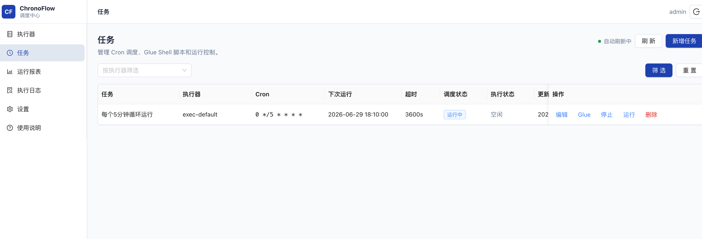
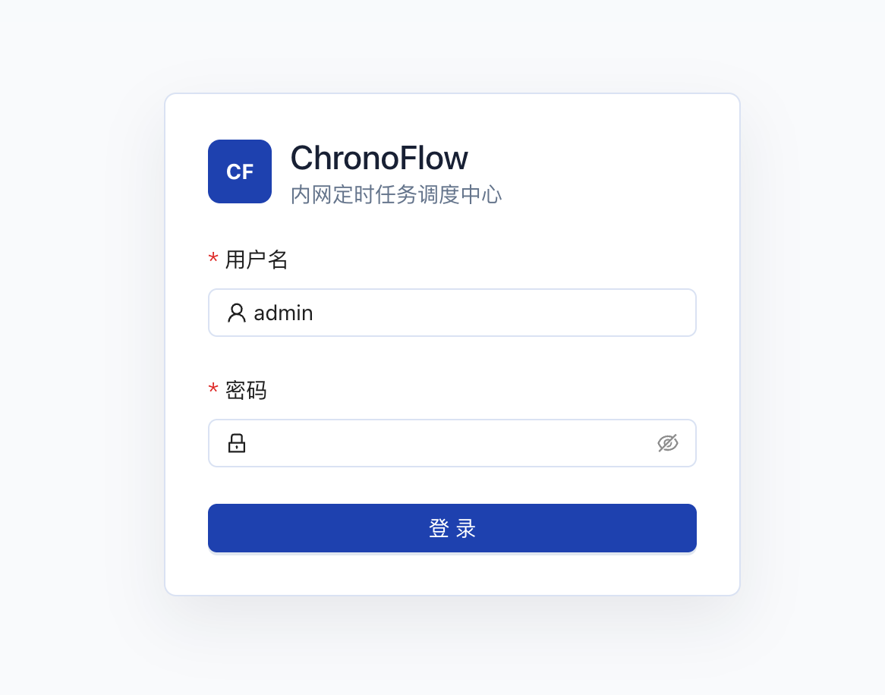
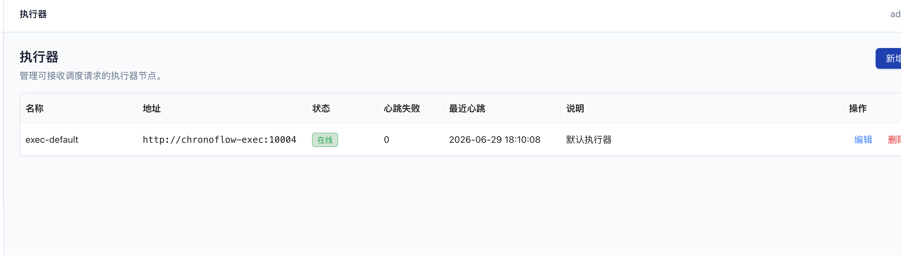
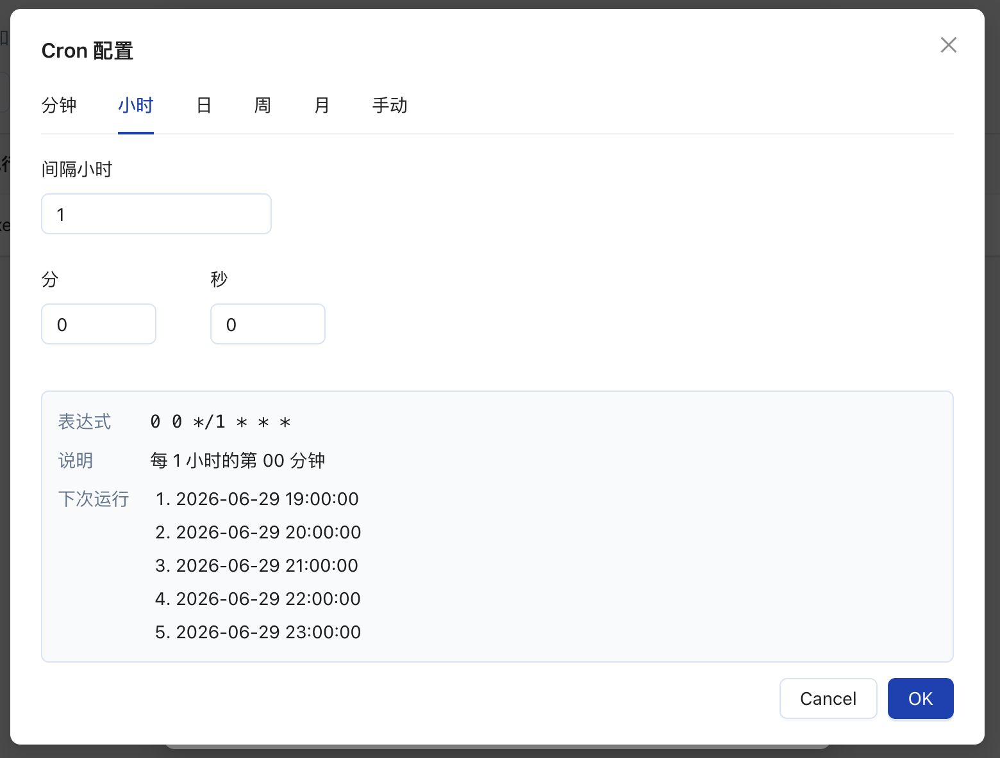
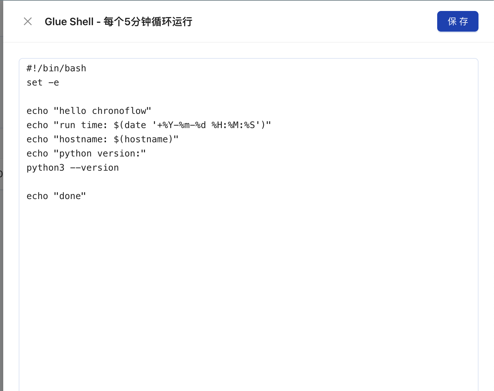
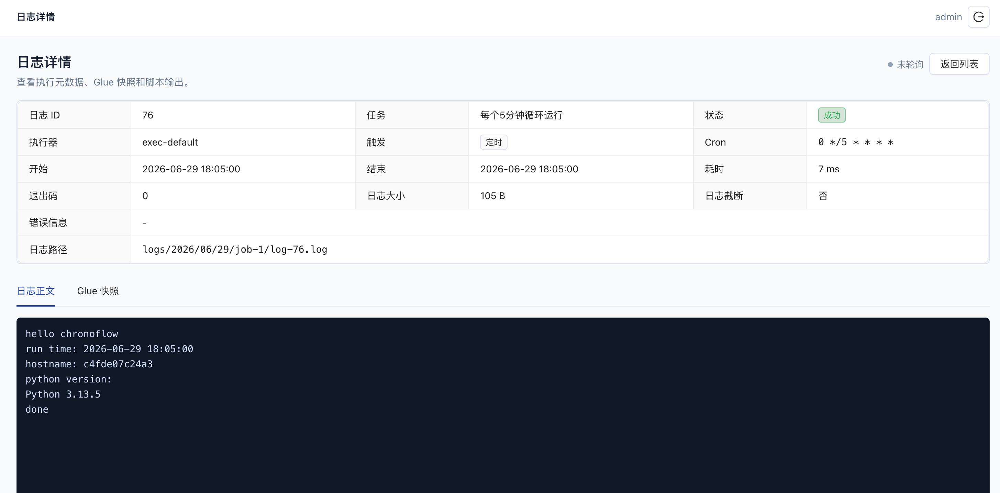
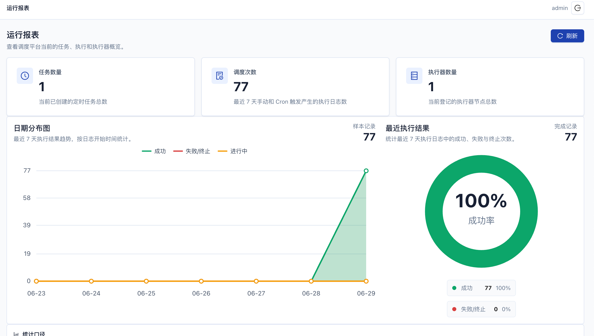

<h1 align="center">ChronoFlow</h1>

<p align="center">
  轻量级内网定时任务调度平台，面向单团队、少量任务、Shell / Python 脚本调度场景。
</p>

<p align="center">
  <a href="README.en.md">English</a>
  ·
  <a href="deploy/README.md">部署指南</a>
  ·
  <a href="docs/TESTING_GUIDE.md">测试指南</a>
</p>

<p align="center">
  
  
  
  
</p>

<p align="center">
  
</p>

## ChronoFlow 是什么

ChronoFlow 是一个面向内网单团队使用的轻量定时任务平台。它包含调度器后端、执行器后端和 Web 调度中心，支持 Cron 定时、手动运行、Glue Shell、异步回调、任务终止、执行日志和运行报表。

如果你现在用 crontab 管理一堆 Shell / Python 脚本，但已经开始遇到这些问题：

- 不方便查看任务列表和下次运行时间
- 不方便手动运行、停止调度或终止长任务
- 不方便查看 stdout / stderr 和失败原因
- 不方便把脚本执行交给非运维同学操作
- 不想引入太重的分布式调度系统

那么 ChronoFlow 的目标就是把这些日常调度需求放进一个更直观的 Web 平台里。

## 功能亮点

| 能力 | 说明 |
| --- | --- |
| 执行器管理 | 新增、编辑、删除执行器，展示在线/离线和心跳状态。 |
| 任务管理 | 创建任务、编辑任务、启动调度、停止调度、手动运行。 |
| Cron 可视化 | 支持分钟、小时、日、周、月配置和手动表达式，并预览最近运行时间。 |
| Glue Shell | 每个任务保存一段 Shell 脚本，可调用挂载到执行器容器内的 Python 或其他脚本。 |
| 异步回调 | Admin 下发执行请求后立即返回，Exec 执行完成后回调 Admin。 |
| 同任务互斥 | 同一个任务不能并发运行，不同任务可以并行。 |
| 任务终止 | Admin 请求 Exec kill 进程组，适合 Shell 再拉起 Python 子进程的场景。 |
| 日志存储 | MySQL 只保存日志元数据，完整日志正文保存为文件。 |
| 运行报表 | 展示任务数量、调度次数、执行器数量、成功率和近 7 天趋势。 |
| 飞书失败告警 | 在系统设置中配置飞书 Webhook，任务失败或超时时发送卡片告警。 |

## 界面预览

| 登录 | 执行器 |
| --- | --- |
|  |  |

| Cron 配置 | Glue Shell |
| --- | --- |
|  |  |

| 日志详情 | 运行报表 |
| --- | --- |
|  |  |

## 快速开始

ChronoFlow 支持两种 Docker 部署方式：

- **作者镜像部署**：适合服务器空间较小、不想拉完整源码的场景。
- **源码构建部署**：适合开发者本地修改代码后自行构建镜像。

### 方式一：作者镜像部署

服务器只需要复制 `deploy` 目录中的部署文件，不需要拉完整源码。

```bash
cd deploy
cp .env.example .env
```

已发布镜像可以在 [GitHub Packages](https://github.com/Honghuaijie?tab=packages) 查看。

推荐使用固定版本镜像，便于回滚和排查问题：

```env
CHRONOFLOW_ADMIN_IMAGE=ghcr.io/honghuaijie/chronoflow-admin:v0.1.3
CHRONOFLOW_EXEC_IMAGE=ghcr.io/honghuaijie/chronoflow-exec:v0.1.3
CHRONOFLOW_UI_IMAGE=ghcr.io/honghuaijie/chronoflow-ui:v0.1.3
```

如果需要使用项目内置 MySQL：

```bash
docker compose -f docker-compose.mysql.yml up -d
```

启动应用：

```bash
docker compose -f docker-compose.image.yml up -d
```

### 方式二：源码构建部署

```bash
git clone https://github.com/Honghuaijie/chronoFlow.git chronoflow
cd chronoflow/deploy
cp .env.example .env
```

如果需要使用项目内置 MySQL：

```bash
docker compose -f docker-compose.mysql.yml up -d
```

启动应用：

```bash
docker compose up -d --build
```

打开：

```text
http://127.0.0.1:5173
```

默认账号：

```text
admin / admin123
```

生产环境请在 `.env` 中修改默认管理员密码、JWT Secret、Callback Token、执行器 Token 和数据库密码。

详细部署、端口、MySQL、外部数据库、脚本挂载和常见问题见 [deploy/README.md](deploy/README.md)。

## 首次使用

### 1. 新增执行器

如果 Admin 和 Exec 都由同一个 compose 启动，在 UI 新增执行器时填写：

```text
名称：exec-default
地址：http://chronoflow-exec:10004
Token：填写 .env 中的 EXECUTOR_TOKEN
```

不要填写 `http://127.0.0.1:10004`，因为对 Admin 容器来说，`127.0.0.1` 是 Admin 容器自己，不是 Exec 容器。

### 2. 新建测试任务

可以创建一个 Glue Shell 任务验证完整链路：

```bash
#!/bin/bash
set -e

echo "hello chronoflow"
echo "run time: $(date '+%Y-%m-%d %H:%M:%S')"
echo "hostname: $(hostname)"
python3 --version
echo "done"
```

手动运行后，在执行日志中应看到状态为 `success`，并能看到脚本输出。

### 3. 配置失败告警

进入“系统设置”，粘贴飞书自定义机器人的 Webhook 并保存。创建或编辑任务时开启“失败告警”，当任务最终状态为 `failed` 或 `timeout` 时，ChronoFlow 会发送飞书卡片。

如果飞书机器人开启了关键词校验，请在飞书机器人安全设置中把关键词配置为 `ChronoFlow`。V1 不支持飞书签名 Secret；失败判断依赖进程退出码，不解析日志正文。Glue Shell 调用 Python 时建议使用 `set -euo pipefail`，确保 Python 报错会让任务返回非 0 退出码。

## 架构

```text
UI -> Admin -> Exec
       ^        |
       |        v
       +-- callback
```

- `chronoFlow-admin` 是唯一连接 MySQL 的服务。
- `chronoFlow-exec` 不连接 MySQL。
- Admin 调用 Exec 使用每个执行器自己的 `X-Executor-Token`。
- Exec 回调 Admin 使用全局 `X-Callback-Token`。
- Exec 回调失败时会把待回调结果落盘，并在后台持续重试，默认保留 7 天。

## 项目结构

```text
chronoFlow/
├── chronoFlow-admin/        # 调度器后端，连接 MySQL
├── chronoFlow-exec/         # 执行器后端，不连接数据库
├── chronoFlow-ui/           # 调度中心前端
├── deploy/                  # Docker Compose、env 模板、MySQL 初始化和脚本挂载
└── docs/                    # PRD、测试指南、开发计划和过程记录
```

## 开发模式

如果你要改代码，可以分别启动三个模块：

```bash
cd chronoFlow-admin
go run ./cmd/chronoFlow-admin -conf ./configs
```

```bash
cd chronoFlow-exec
go run ./cmd/chronoFlow-exec -conf ./configs
```

```bash
cd chronoFlow-ui
npm install
VITE_API_PROXY_TARGET=http://127.0.0.1:10003 npm run dev
```

## 验证命令

```bash
cd chronoFlow-admin
go test ./internal/... -count=1
```

```bash
cd chronoFlow-exec
go test ./internal/... -count=1
```

```bash
cd chronoFlow-ui
npm run build
```

完整测试指南见 [docs/TESTING_GUIDE.md](docs/TESTING_GUIDE.md)。

## 适用场景

ChronoFlow 当前更适合：

- 内网环境
- 单团队使用
- 几十个以内任务
- 单调度器
- Shell / Python 脚本调度
- 希望轻量部署
- 希望有 Web 页面和日志查看

它暂时不定位为大规模分布式任务调度平台，也不追求复杂的多租户、权限体系和海量任务调度能力。

## 生产注意事项

- 修改默认管理员密码、JWT Secret、Callback Token、执行器 Token 和数据库密码。
- `CHRONOFLOW_TOKEN_ENCRYPT_KEY` 必须是 32 字节；修改后，已保存的执行器 token 密文无法用新密钥解密。
- 执行器真实进程组终止语义只支持 Linux。
- 不要把完整日志正文写入 MySQL；MySQL 只保存元数据。
- 执行器不需要数据库配置，也不应该连接 Admin 的数据库。
- 不要提交 `deploy/.env`、运行日志、数据库密码或 GitHub Token。
